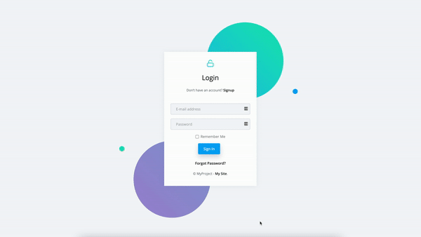
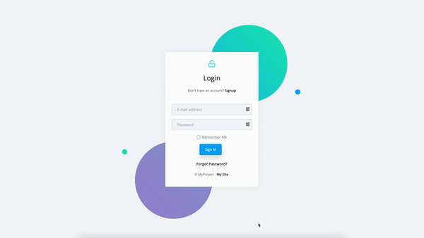
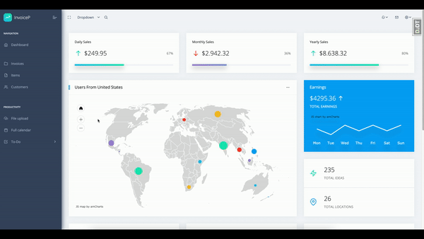
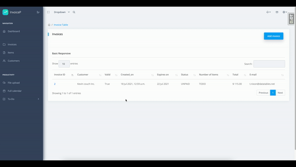
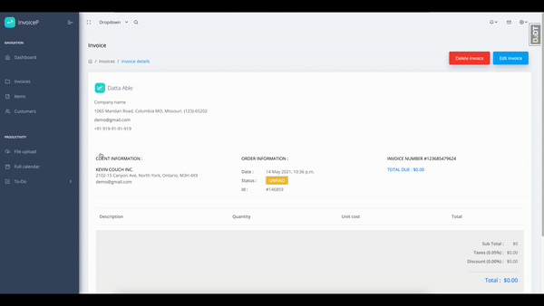
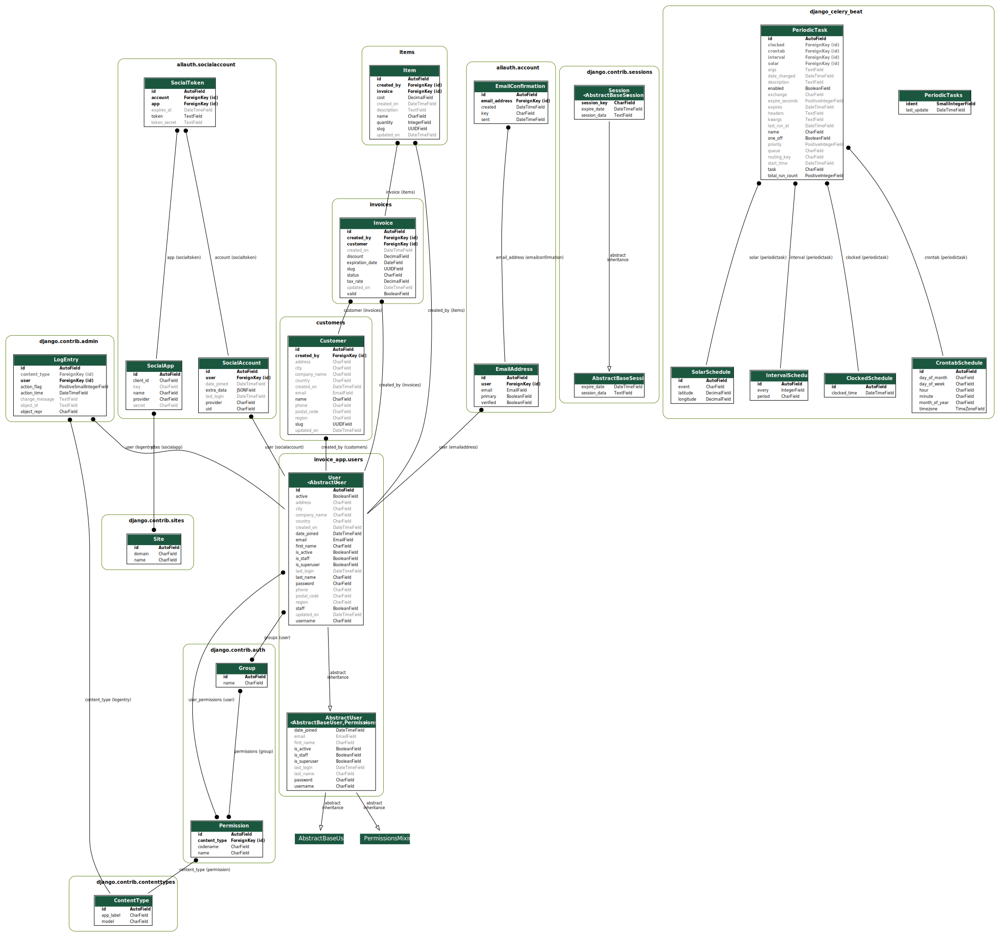

Invoice App
===========

An invoicing app project I built using django-cookiecutter, Docker, PostgreSQL, hosted on AWS EC2.

This app features authentication using allauth module c/w login, logout, password reset, signup

Additionally CRUD for customers, invoices and items

HTML/CSS/JS assets were purchased because the point of this project was to focus on Django functionality

.. image:: https://img.shields.io/badge/built%20with-Cookiecutter%20Django-ff69b4.svg?logo=cookiecutter
     :target: https://github.com/pydanny/cookiecutter-django/
     :alt: Built with Cookiecutter Django
.. image:: https://img.shields.io/badge/code%20style-black-000000.svg
     :target: https://github.com/ambv/black
     :alt: Black code style

Usage (requires Docker and docker-compose)
--------------

Clone project:
::

$ git clone https://github.com/periwinkleFTW/inv_aws

Navigate to the project directory:
::

$ cd inv_aws/

Build docker image using docker-compose for local development:
::

$ docker-compose -f local.yml build

Start the image you just built (add -d for detached mode):
::

$ docker-compose -f local.yml up

Make migrations:
::

$ docker-compose -f local.yml python manage.py makemigrations

Apply migrations:
::

$ docker-compose -f local.yml python manage.py migrate

Create superuser:
::

$ docker-compose -f local.yml python manage.py createsuper

Features
--------------

Sign up
^^^^^^^^^^^^^^^^^^^^^

Login / Logout
^^^^^^^^^^^^^^^^^^^^^

Invoices
^^^^^^^^^^^^^^^^^^^^^

* Display invoices created by this user and view invoices by selecting an invoice from the list

* User can create new invoices

* User can edit/delete invoices he created

Customers
^^^^^^^^^^^^^^^^^^^^^

* Display customers created by this user and view customers by selecting a customer from the list

* User can create new customers

* User can edit/delete customers he created

Items
^^^^^^^^^^^^^^^^^^^^^

* Display items created by this user and view items by selecting a items from the list

* User can create new items

* User can edit/delete items he created

Design documentation
--------------
To speed up the development process and simplify deployment django-cookiecutter template was used with Docker

App contains four core models:

1. User
2. Customer
3. Invoice
4. Items

Invoice model has two ForeignKey relationships: to User and to Customer

Item model has two ForeignKey relationships: to User and to Invoice

Customer model has one ForeignKey relationships: to User

The reason why each model has a ForeignKey pointing to the user is to control permissions and
facilitate filtering objects based on ownership.

Only objects created by this particular user can be viewed/updated/deleted.

Full visualization of all model relationships can be seen in this figure:

Routing
^^^^^^^^^^^^^^^^^^^^^
::

/       django.views.generic.base.TemplateView  home
/400/   django.views.defaults.bad_request
/403/   django.views.defaults.permission_denied
/404/   django.views.defaults.page_not_found
/500/   django.views.defaults.server_error
/__debug__/history_refresh/     debug_toolbar.panels.history.views.history_refresh      djdt:history_refresh
/__debug__/history_sidebar/     debug_toolbar.panels.history.views.history_sidebar      djdt:history_sidebar
/__debug__/render_panel/        debug_toolbar.views.render_panel        djdt:render_panel
/__debug__/sql_explain/ debug_toolbar.panels.sql.views.sql_explain      djdt:sql_explain
/__debug__/sql_profile/ debug_toolbar.panels.sql.views.sql_profile      djdt:sql_profile
/__debug__/sql_select/  debug_toolbar.panels.sql.views.sql_select       djdt:sql_select
/__debug__/template_source/     debug_toolbar.panels.templates.views.template_source    djdt:template_source
/about/ django.views.generic.base.TemplateView  about
/accounts/confirm-email/        allauth.account.views.EmailVerificationSentView account_email_verification_sent
/accounts/confirm-email/<key>/  allauth.account.views.ConfirmEmailView  account_confirm_email
/accounts/email/        allauth.account.views.EmailView account_email
/accounts/inactive/     allauth.account.views.AccountInactiveView       account_inactive
/accounts/login/        allauth.account.views.LoginView account_login
/accounts/logout/       allauth.account.views.LogoutView        account_logout
/accounts/password/change/      allauth.account.views.PasswordChangeView        account_change_password
/accounts/password/reset/       allauth.account.views.PasswordResetView account_reset_password
/accounts/password/reset/done/  allauth.account.views.PasswordResetDoneView     account_reset_password_done
/accounts/password/reset/key/<uidb36>-<key>/    allauth.account.views.PasswordResetFromKeyView  account_reset_password_from_key
/accounts/password/reset/key/done/      allauth.account.views.PasswordResetFromKeyDoneView      account_reset_password_from_key_done
/accounts/password/set/ allauth.account.views.PasswordSetView   account_set_password
/accounts/signup/       allauth.account.views.SignupView        account_signup
/accounts/social/connections/   allauth.socialaccount.views.ConnectionsView     socialaccount_connections
/accounts/social/login/cancelled/       allauth.socialaccount.views.LoginCancelledView  socialaccount_login_cancelled
/accounts/social/login/error/   allauth.socialaccount.views.LoginErrorView      socialaccount_login_error
/accounts/social/signup/        allauth.socialaccount.views.SignupView  socialaccount_signup
/admin/ django.contrib.admin.sites.index        admin:index
/admin/<app_label>/     django.contrib.admin.sites.app_index    admin:app_list
/admin/account/emailaddress/    django.contrib.admin.options.changelist_view    admin:account_emailaddress_changelist
/admin/account/emailaddress/<path:object_id>/   django.views.generic.base.RedirectView
/admin/account/emailaddress/<path:object_id>/change/    django.contrib.admin.options.change_view        admin:account_emailaddress_change
/admin/account/emailaddress/<path:object_id>/delete/    django.contrib.admin.options.delete_view        admin:account_emailaddress_delete
/admin/account/emailaddress/<path:object_id>/history/   django.contrib.admin.options.history_view       admin:account_emailaddress_history
/admin/account/emailaddress/add/        django.contrib.admin.options.add_view   admin:account_emailaddress_add
/admin/account/emailaddress/autocomplete/       django.contrib.admin.options.autocomplete_view  admin:account_emailaddress_autocomplete
/admin/auth/group/      django.contrib.admin.options.changelist_view    admin:auth_group_changelist
/admin/auth/group/<path:object_id>/     django.views.generic.base.RedirectView
/admin/auth/group/<path:object_id>/change/      django.contrib.admin.options.change_view        admin:auth_group_change
/admin/auth/group/<path:object_id>/delete/      django.contrib.admin.options.delete_view        admin:auth_group_delete
/admin/auth/group/<path:object_id>/history/     django.contrib.admin.options.history_view       admin:auth_group_history
/admin/auth/group/add/  django.contrib.admin.options.add_view   admin:auth_group_add
/admin/auth/group/autocomplete/ django.contrib.admin.options.autocomplete_view  admin:auth_group_autocomplete
/admin/customers/customer/      django.contrib.admin.options.changelist_view    admin:customers_customer_changelist
/admin/customers/customer/<path:object_id>/     django.views.generic.base.RedirectView
/admin/customers/customer/<path:object_id>/change/      django.contrib.admin.options.change_view        admin:customers_customer_change
/admin/customers/customer/<path:object_id>/delete/      django.contrib.admin.options.delete_view        admin:customers_customer_delete
/admin/customers/customer/<path:object_id>/history/     django.contrib.admin.options.history_view       admin:customers_customer_history
/admin/customers/customer/add/  django.contrib.admin.options.add_view   admin:customers_customer_add
/admin/customers/customer/autocomplete/ django.contrib.admin.options.autocomplete_view  admin:customers_customer_autocomplete
/admin/django_celery_beat/clockedschedule/      django.contrib.admin.options.changelist_view    admin:django_celery_beat_clockedschedule_changelist
/admin/django_celery_beat/clockedschedule/<path:object_id>/     django.views.generic.base.RedirectView
/admin/django_celery_beat/clockedschedule/<path:object_id>/change/      django.contrib.admin.options.change_view        admin:django_celery_beat_clockedschedule_change
/admin/django_celery_beat/clockedschedule/<path:object_id>/delete/      django.contrib.admin.options.delete_view        admin:django_celery_beat_clockedschedule_delete
/admin/django_celery_beat/clockedschedule/<path:object_id>/history/     django.contrib.admin.options.history_view       admin:django_celery_beat_clockedschedule_history
/admin/django_celery_beat/clockedschedule/add/  django.contrib.admin.options.add_view   admin:django_celery_beat_clockedschedule_add
/admin/django_celery_beat/clockedschedule/autocomplete/ django.contrib.admin.options.autocomplete_view  admin:django_celery_beat_clockedschedule_autocomplete
/admin/django_celery_beat/crontabschedule/      django.contrib.admin.options.changelist_view    admin:django_celery_beat_crontabschedule_changelist
/admin/django_celery_beat/crontabschedule/<path:object_id>/     django.views.generic.base.RedirectView
/admin/django_celery_beat/crontabschedule/<path:object_id>/change/      django.contrib.admin.options.change_view        admin:django_celery_beat_crontabschedule_change
/admin/django_celery_beat/crontabschedule/<path:object_id>/delete/      django.contrib.admin.options.delete_view        admin:django_celery_beat_crontabschedule_delete
/admin/django_celery_beat/crontabschedule/<path:object_id>/history/     django.contrib.admin.options.history_view       admin:django_celery_beat_crontabschedule_history
/admin/django_celery_beat/crontabschedule/add/  django.contrib.admin.options.add_view   admin:django_celery_beat_crontabschedule_add
/admin/django_celery_beat/crontabschedule/autocomplete/ django.contrib.admin.options.autocomplete_view  admin:django_celery_beat_crontabschedule_autocomplete
/admin/django_celery_beat/intervalschedule/     django.contrib.admin.options.changelist_view    admin:django_celery_beat_intervalschedule_changelist
/admin/django_celery_beat/intervalschedule/<path:object_id>/    django.views.generic.base.RedirectView
/admin/django_celery_beat/intervalschedule/<path:object_id>/change/     django.contrib.admin.options.change_view        admin:django_celery_beat_intervalschedule_change
/admin/django_celery_beat/intervalschedule/<path:object_id>/delete/     django.contrib.admin.options.delete_view        admin:django_celery_beat_intervalschedule_delete
/admin/django_celery_beat/intervalschedule/<path:object_id>/history/    django.contrib.admin.options.history_view       admin:django_celery_beat_intervalschedule_history
/admin/django_celery_beat/intervalschedule/add/ django.contrib.admin.options.add_view   admin:django_celery_beat_intervalschedule_add
/admin/django_celery_beat/intervalschedule/autocomplete/        django.contrib.admin.options.autocomplete_view  admin:django_celery_beat_intervalschedule_autocomplete
/admin/django_celery_beat/periodictask/ django_celery_beat.admin.changelist_view        admin:django_celery_beat_periodictask_changelist
/admin/django_celery_beat/periodictask/<path:object_id>/        django.views.generic.base.RedirectView
/admin/django_celery_beat/periodictask/<path:object_id>/change/ django.contrib.admin.options.change_view        admin:django_celery_beat_periodictask_change
/admin/django_celery_beat/periodictask/<path:object_id>/delete/ django.contrib.admin.options.delete_view        admin:django_celery_beat_periodictask_delete
/admin/django_celery_beat/periodictask/<path:object_id>/history/        django.contrib.admin.options.history_view       admin:django_celery_beat_periodictask_history
/admin/django_celery_beat/periodictask/add/     django.contrib.admin.options.add_view   admin:django_celery_beat_periodictask_add
/admin/django_celery_beat/periodictask/autocomplete/    django.contrib.admin.options.autocomplete_view  admin:django_celery_beat_periodictask_autocomplete
/admin/django_celery_beat/solarschedule/        django.contrib.admin.options.changelist_view    admin:django_celery_beat_solarschedule_changelist
/admin/django_celery_beat/solarschedule/<path:object_id>/       django.views.generic.base.RedirectView
/admin/django_celery_beat/solarschedule/<path:object_id>/change/        django.contrib.admin.options.change_view        admin:django_celery_beat_solarschedule_change
/admin/django_celery_beat/solarschedule/<path:object_id>/delete/        django.contrib.admin.options.delete_view        admin:django_celery_beat_solarschedule_delete
/admin/django_celery_beat/solarschedule/<path:object_id>/history/       django.contrib.admin.options.history_view       admin:django_celery_beat_solarschedule_history
/admin/django_celery_beat/solarschedule/add/    django.contrib.admin.options.add_view   admin:django_celery_beat_solarschedule_add
/admin/django_celery_beat/solarschedule/autocomplete/   django.contrib.admin.options.autocomplete_view  admin:django_celery_beat_solarschedule_autocomplete
/admin/invoices/invoice/        django.contrib.admin.options.changelist_view    admin:invoices_invoice_changelist
/admin/invoices/invoice/<path:object_id>/       django.views.generic.base.RedirectView
/admin/invoices/invoice/<path:object_id>/change/        django.contrib.admin.options.change_view        admin:invoices_invoice_change
/admin/invoices/invoice/<path:object_id>/delete/        django.contrib.admin.options.delete_view        admin:invoices_invoice_delete
/admin/invoices/invoice/<path:object_id>/history/       django.contrib.admin.options.history_view       admin:invoices_invoice_history
/admin/invoices/invoice/add/    django.contrib.admin.options.add_view   admin:invoices_invoice_add
/admin/invoices/invoice/autocomplete/   django.contrib.admin.options.autocomplete_view  admin:invoices_invoice_autocomplete
/admin/items/item/      django.contrib.admin.options.changelist_view    admin:items_item_changelist
/admin/items/item/<path:object_id>/     django.views.generic.base.RedirectView
/admin/items/item/<path:object_id>/change/      django.contrib.admin.options.change_view        admin:items_item_change
/admin/items/item/<path:object_id>/delete/      django.contrib.admin.options.delete_view        admin:items_item_delete
/admin/items/item/<path:object_id>/history/     django.contrib.admin.options.history_view       admin:items_item_history
/admin/items/item/add/  django.contrib.admin.options.add_view   admin:items_item_add
/admin/items/item/autocomplete/ django.contrib.admin.options.autocomplete_view  admin:items_item_autocomplete
/admin/jsi18n/  django.contrib.admin.sites.i18n_javascript      admin:jsi18n
/admin/login/   django.contrib.admin.sites.login        admin:login
/admin/logout/  django.contrib.admin.sites.logout       admin:logout
/admin/password_change/ django.contrib.admin.sites.password_change      admin:password_change
/admin/password_change/done/    django.contrib.admin.sites.password_change_done admin:password_change_done
/admin/r/<int:content_type_id>/<path:object_id>/        django.contrib.contenttypes.views.shortcut      admin:view_on_site
/admin/sites/site/      django.contrib.admin.options.changelist_view    admin:sites_site_changelist
/admin/sites/site/<path:object_id>/     django.views.generic.base.RedirectView
/admin/sites/site/<path:object_id>/change/      django.contrib.admin.options.change_view        admin:sites_site_change
/admin/sites/site/<path:object_id>/delete/      django.contrib.admin.options.delete_view        admin:sites_site_delete
/admin/sites/site/<path:object_id>/history/     django.contrib.admin.options.history_view       admin:sites_site_history
/admin/sites/site/add/  django.contrib.admin.options.add_view   admin:sites_site_add
/admin/sites/site/autocomplete/ django.contrib.admin.options.autocomplete_view  admin:sites_site_autocomplete
/admin/socialaccount/socialaccount/     django.contrib.admin.options.changelist_view    admin:socialaccount_socialaccount_changelist
/admin/socialaccount/socialaccount/<path:object_id>/    django.views.generic.base.RedirectView
/admin/socialaccount/socialaccount/<path:object_id>/change/     django.contrib.admin.options.change_view        admin:socialaccount_socialaccount_change
/admin/socialaccount/socialaccount/<path:object_id>/delete/     django.contrib.admin.options.delete_view        admin:socialaccount_socialaccount_delete
/admin/socialaccount/socialaccount/<path:object_id>/history/    django.contrib.admin.options.history_view       admin:socialaccount_socialaccount_history
/admin/socialaccount/socialaccount/add/ django.contrib.admin.options.add_view   admin:socialaccount_socialaccount_add
/admin/socialaccount/socialaccount/autocomplete/        django.contrib.admin.options.autocomplete_view  admin:socialaccount_socialaccount_autocomplete
/admin/socialaccount/socialapp/ django.contrib.admin.options.changelist_view    admin:socialaccount_socialapp_changelist
/admin/socialaccount/socialapp/<path:object_id>/        django.views.generic.base.RedirectView
/admin/socialaccount/socialapp/<path:object_id>/change/ django.contrib.admin.options.change_view        admin:socialaccount_socialapp_change
/admin/socialaccount/socialapp/<path:object_id>/delete/ django.contrib.admin.options.delete_view        admin:socialaccount_socialapp_delete
/admin/socialaccount/socialapp/<path:object_id>/history/        django.contrib.admin.options.history_view       admin:socialaccount_socialapp_history
/admin/socialaccount/socialapp/add/     django.contrib.admin.options.add_view   admin:socialaccount_socialapp_add
/admin/socialaccount/socialapp/autocomplete/    django.contrib.admin.options.autocomplete_view  admin:socialaccount_socialapp_autocomplete
/admin/socialaccount/socialtoken/       django.contrib.admin.options.changelist_view    admin:socialaccount_socialtoken_changelist
/admin/socialaccount/socialtoken/<path:object_id>/      django.views.generic.base.RedirectView
/admin/socialaccount/socialtoken/<path:object_id>/change/       django.contrib.admin.options.change_view        admin:socialaccount_socialtoken_change
/admin/socialaccount/socialtoken/<path:object_id>/delete/       django.contrib.admin.options.delete_view        admin:socialaccount_socialtoken_delete
/admin/socialaccount/socialtoken/<path:object_id>/history/      django.contrib.admin.options.history_view       admin:socialaccount_socialtoken_history
/admin/socialaccount/socialtoken/add/   django.contrib.admin.options.add_view   admin:socialaccount_socialtoken_add
/admin/socialaccount/socialtoken/autocomplete/  django.contrib.admin.options.autocomplete_view  admin:socialaccount_socialtoken_autocomplete
/admin/users/user/      django.contrib.admin.options.changelist_view    admin:users_user_changelist
/admin/users/user/<id>/password/        django.contrib.auth.admin.user_change_password  admin:auth_user_password_change
/admin/users/user/<path:object_id>/     django.views.generic.base.RedirectView
/admin/users/user/<path:object_id>/change/      django.contrib.admin.options.change_view        admin:users_user_change
/admin/users/user/<path:object_id>/delete/      django.contrib.admin.options.delete_view        admin:users_user_delete
/admin/users/user/<path:object_id>/history/     django.contrib.admin.options.history_view       admin:users_user_history
/admin/users/user/add/  django.contrib.auth.admin.add_view      admin:users_user_add
/admin/users/user/autocomplete/ django.contrib.admin.options.autocomplete_view  admin:users_user_autocomplete
/calendar/      django.views.generic.base.TemplateView  calendar
/customers/<uuid:slug>  customers.views.CustomerDetailView      customers:customer_detail
/customers/create       customers.views.CustomerCreateView      customers:customer_create
/customers/delete/<uuid:slug>   customers.views.CustomerDeleteView      customers:customer_delete
/customers/list customers.views.CustomerListView        customers:customer_list
/customers/update/<uuid:slug>   customers.views.CustomerUpdateView      customers:customer_update
/invoices/<uuid:slug>   invoices.views.InvoiceDetailView        invoices:invoice_detail
/invoices/create        invoices.views.InvoiceCreateView        invoices:invoice_create
/invoices/delete/<uuid:slug>    invoices.views.InvoiceDeleteView        invoices:invoice_delete
/invoices/list  invoices.views.InvoiceListView  invoices:invoice_list
/invoices/update/<uuid:slug>    invoices.views.InvoiceUpdateView        invoices:invoice_update
/items/<uuid:slug>      items.views.ItemDetailView      items:item_detail
/items/create   items.views.ItemCreateView      items:item_create
/items/delete/<uuid:slug>       items.views.ItemDeleteView      items:item_delete
/items/list     items.views.ItemListView        items:item_list
/items/update/<uuid:slug>       items.views.ItemUpdateView      items:item_update
/media/<path>   django.views.static.serve
/users/<str:username>/  invoice_app.users.views.UserDetailView  users:detail
/users/~redirect/       invoice_app.users.views.UserRedirectView        users:redirect
/users/~update/ invoice_app.users.views.UserUpdateView  users:update

